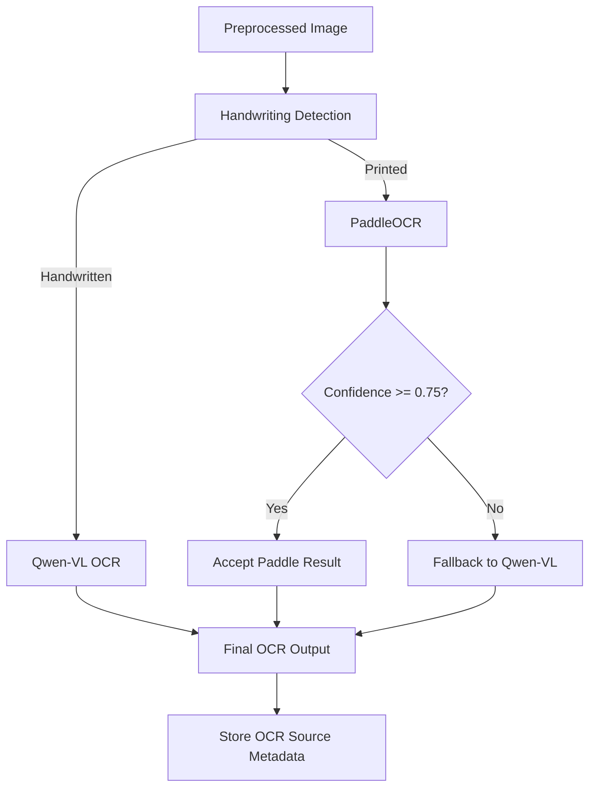
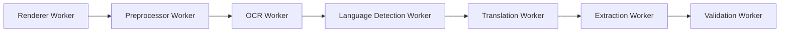
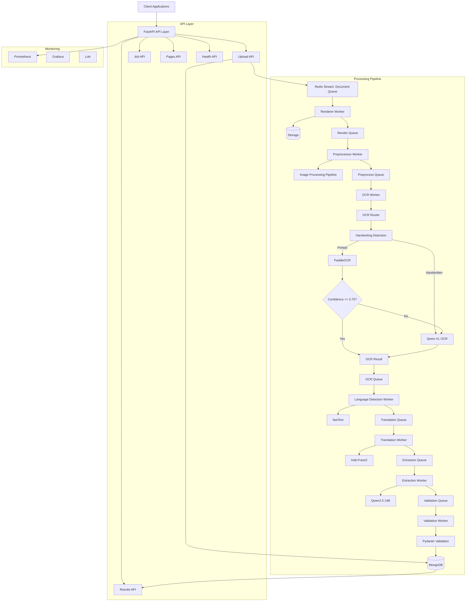

<div align="center">

# 🔍 OCR Engine — Hybrid AI-Powered Document Intelligence Platform

### Production-Grade, Event-Driven OCR & Document Extraction System for Indian Government & Enterprise Documents

**Aadhaar Card OCR • PAN Card OCR • Invoice OCR • FRA Forms • Land Claim Documents • Handwritten Text Recognition**

[](https://www.python.org/)
[](https://fastapi.tiangolo.com/)
[](https://www.mongodb.com/)
[](https://redis.io/)
[](https://github.com/PaddlePaddle/PaddleOCR)
[](https://github.com/QwenLM/Qwen-VL)
[](https://www.docker.com/)
[](#license)

**A complete engineering case study in building an event-driven OCR pipeline: system design, distributed workers, hybrid AI model routing, and production observability — not just an OCR API wrapper.**

[Overview](#-why-this-project) • [Architecture](#-system-architecture) • [OCR Comparison](#-ocr-output-comparison-printed-vs-handwritten) • [Tech Stack](#-technology-stack) • [API Reference](#-api-reference) • [Setup](#-local-setup) • [Roadmap](#-future-improvements)

</div>

---

## � Credit

Built and designed by **Amol Rakh**  
**Software Developer**

---

## �📌 About This Project

**OCR Engine** is a production-style, event-driven document processing platform built to handle real-world OCR workloads at scale — the kind of documents government and enterprise systems actually deal with: **Aadhaar cards, PAN cards, invoices, Forest Rights Act (FRA) claim forms, and land record documents.**

Rather than wrapping a single OCR library behind an API, this project is architected as a **multi-stage, asynchronous document intelligence pipeline** — combining computer vision preprocessing, hybrid OCR model routing, language detection, machine translation, document classification, and schema-validated structured extraction, all coordinated through a message-queue-driven worker system.

This repository is intended to demonstrate applied skills in:

- 🏗️ **System design** — event-driven architecture, service decomposition, async worker orchestration
- 🤖 **Applied AI/ML engineering** — hybrid model routing between PaddleOCR and Qwen-VL based on confidence and handwriting detection
- 🇮🇳 **Indian language OCR** — built with first-class support for Indian regional languages, not just English, across the OCR, language detection, and translation stages
- 🌐 **Multilingual NLP pipelines** — language identification (fastText) and translation (IndicTrans2) for Indian regional languages
- 🏷️ **Named Entity Recognition (NER)** — entity-aware extraction that identifies names, locations, dates, and document-specific identifiers directly from OCR text
- 📐 **Structured data extraction** — LLM-assisted extraction (Qwen2.5) validated through strict Pydantic schemas
- 📊 **Production observability** — Prometheus metrics, Grafana dashboards, structured logging with Loki
- ⚙️ **Distributed backend engineering** — Redis Streams for queueing, MongoDB for state/persistence, retry-safe and dead-letter-aware workers

---

## 🎯 Why This Project?

Most public "OCR" repositories are thin wrappers around Tesseract or a single vision API. This project instead demonstrates a **complete engineering approach** to solving OCR as a real backend systems problem:

| Capability                           | Implementation                                                                                               |
| ------------------------------------ | ------------------------------------------------------------------------------------------------------------ |
| **End-to-end ingestion pipeline**    | Upload → Queue → Render → Preprocess → OCR → Translate → Extract → Validate → Persist                        |
| **Hybrid OCR strategy**              | PaddleOCR (fast, primary) with automatic Qwen-VL fallback (accuracy-critical / handwritten cases)            |
| **Indian language OCR support**      | OCR, language detection, and translation stages are built around Indian regional languages, not just English |
| **Handwriting-aware routing**        | Documents are classified as handwritten vs. printed _before_ OCR engine selection                            |
| **Named Entity Recognition (NER)**   | Extraction stage identifies names, locations, dates, and identifiers as typed entities, not just raw text    |
| **Multi-stage async pipeline**       | 7 independently scalable workers connected via Redis Streams                                                 |
| **Stateful job tracking**            | MongoDB-backed job lifecycle, page-level OCR metadata, and result persistence                                |
| **Full observability stack**         | Prometheus + Grafana + structured logging (Loki-compatible) out of the box                                   |
| **Modular, extensible architecture** | Clear separation of API / service / worker / ML / persistence layers for production scaling                  |

---

## 🏛️ System Architecture

The platform follows an **event-driven, queue-based architecture**. The API layer is a thin ingestion surface — it accepts uploads, persists job metadata to MongoDB, and immediately publishes a work item to Redis Streams. From there, a chain of independent background workers processes each pipeline stage asynchronously, which means the system scales horizontally and degrades gracefully under load.

### 1️⃣ OCR Decision Flow — Hybrid Model Routing

The core intelligence of the engine: every page independently decides _which OCR model handles it_ based on handwriting detection and live confidence scoring.



> 💡 **Engineering note:** This confidence-gated fallback pattern means the system gets the _speed_ of a lightweight OCR engine on the ~90% of documents that are cleanly printed, while automatically escalating to a heavier vision-language model only when needed — balancing cost, latency, and accuracy dynamically per-page rather than per-batch.

### 2️⃣ Worker Pipeline — Sequential Async Stages



### 3️⃣ Full System Architecture



### Core Architectural Components

<table>
<tr><td width="30%"><b>1. API Layer</b></td><td>Built with FastAPI. Exposes endpoints for upload, job status, results, health checks, and admin operations. Fully async, non-blocking I/O throughout.</td></tr>
<tr><td><b>2. Processing Pipeline</b></td><td>Renderer Worker converts PDFs into page images → Preprocessor Worker enhances image quality → OCR Worker runs hybrid OCR (PaddleOCR + Qwen-VL) → Language Detection & Translation Workers handle multilingual text → Extraction & Validation Workers produce clean, structured output.</td></tr>
<tr><td><b>3. Message Queue Layer</b></td><td>Redis Streams orchestrate all asynchronous background processing, with built-in retry and dead-letter handling via shared worker base logic.</td></tr>
<tr><td><b>4. Persistence Layer</b></td><td>MongoDB stores jobs, page-level OCR data, extracted results, and configuration. Local storage handles incoming, processed, failed, and archived files.</td></tr>
<tr><td><b>5. Observability Layer</b></td><td>Prometheus metrics, structured logging via <code>structlog</code>, and health checks across MongoDB, Redis, Ollama, PaddleOCR, and model files.</td></tr>
</table>

---

## 🖼️ OCR Output Comparison — Printed vs. Handwritten Text

One of the key engineering decisions in this system is **routing documents to different OCR engines depending on whether the text is printed or handwritten.** The comparison below shows the same extraction pipeline handling both cases side-by-side.

> ⚠️ **Add your own sample outputs here.** Replace the placeholder image links below with actual before/after screenshots from your pipeline (input document → extracted/structured JSON output) to make this section fully live. Suggested folder: `docs/assets/ocr-samples/`.

<table>
<tr>
<th width="50%" align="center">🖨️ Printed Text (PaddleOCR Path)</th>
<th width="50%" align="center">✍️ Handwritten Text (Qwen-VL Path)</th>
</tr>
<tr>
<td align="center">

<br><sub><b>Input:</b> Printed document (e.g., Aadhar card )</sub>
</td>
<td align="center">

<br><sub><b>Input:</b> Handwritten document (e.g., Test Online Handwritten image )</sub>
</td>
</tr>
<tr>
<td align="center">

<br><sub><b>Output:</b> PaddleOCR → structured JSON (confidence ≥ 0.75)</sub>
</td>
<td align="center">

<br><sub><b>Output:</b> Qwen-VL fallback → structured JSON</sub>
</td>
</tr>
<tr>
<td align="center"><sub>Engine: <code>PaddleOCR</code> · Avg. latency: low · Confidence-gated</sub></td>
<td align="center"><sub>Engine: <code>Qwen-VL (Ollama)</code> · Vision-language model · Higher accuracy on cursive/irregular script</sub></td>
</tr>
</table>

<details>
<summary><b>📄 Example: Structured JSON output schema (click to expand)</b></summary>

```json
{
  "job_id": "64f1a2b3c4d5e6f7a8b9c0d1",
  "document_type": "fra_claim_form",
  "ocr_source": "qwen-vl",
  "ocr_confidence": 0.81,
  "handwriting_detected": true,
  "language_detected": "hi",
  "translated": true,
  "extracted_fields": {
    "claimant_name": "Ramesh Kumar",
    "village": "Chandrapur",
    "district": "Gadchiroli",
    "claim_type": "Individual Forest Rights",
    "land_area_hectares": 2.4,
    "date_of_claim": "2024-03-15"
  },
  "named_entities": [
    { "text": "Ramesh Kumar", "label": "PERSON" },
    { "text": "Chandrapur", "label": "LOCATION" },
    { "text": "Gadchiroli", "label": "LOCATION" },
    { "text": "2024-03-15", "label": "DATE" }
  ],
  "validation_status": "passed"
}
```

</details>

---

## ✨ Key Features

### 1. Hybrid OCR Engine

- **PaddleOCR** as the primary, low-latency OCR engine for printed text
- Automatic **Qwen-VL (via Ollama)** fallback for low-confidence or visually complex cases
- **Handwriting detection** that adjusts the processing path _before_ OCR even runs

### 2. Multi-Language Support — Built for Indian Regional Languages

- Language identification performed directly on OCR output using **fastText**
- Automatic translation of non-English text using **IndicTrans2**-based logic — critical for documents in Hindi, Marathi, and other regional languages common in government workflows
- The OCR, language detection, and translation stages are designed around **Indian-language documents from the start**, not retrofitted onto an English-first pipeline — meaning regional-language Aadhaar cards, FRA forms, and land records can be scanned and processed as effectively as English documents

### 3. Named Entity Recognition (NER) for Document Fields

- The extraction stage doesn't just pull raw text — it identifies **typed entities** within OCR output, such as person names, locations (village/district/state), dates, and document-specific identifiers (claim numbers, PAN/Aadhaar numbers)
- NER runs on **translated, language-normalized text**, so entities are recognized correctly even when the source document was originally in a regional Indian language
- Entity-level output feeds directly into the structured extraction schema, making downstream validation and field-mapping more reliable than plain regex-based extraction

### 4. Structured, Schema-Validated Extraction

- Smart, rule-assisted extraction tuned for known Indian document formats
- Automatic **document-type classification**: Aadhaar, PAN, invoices, FRA forms, land claim documents
- Strict **Pydantic validation layer** ensures every output conforms to an expected, predictable schema — no silent malformed data downstream

### 5. Scalable Background Processing

- Uploads are accepted and acknowledged **immediately**; all heavy lifting happens asynchronously
- Every worker stage runs independently and can be **horizontally scaled** without touching other stages

### 6. Operational Readiness

- `/health` and `/health/detailed` endpoints for full system diagnostics
- `/metrics` endpoint wired for **Prometheus** scraping
- One-command **Docker Compose** setup for all infrastructure dependencies

---

## 🧰 Technology Stack

<table>
<tr><td valign="top" width="25%">

**Backend**

- Python 3.11+
- FastAPI
- Uvicorn
- Pydantic + Pydantic Settings

</td><td valign="top" width="25%">

**Data & Messaging**

- MongoDB
- Redis Streams
- Motor (async MongoDB driver)

</td><td valign="top" width="25%">

**OCR / AI / ML**

- PaddleOCR (with Indian-language model support)
- Qwen-VL (via Ollama)
- fastText (language ID)
- IndicTrans2 (translation)
- NER (named entity recognition on extracted text)
- OpenCV + Pillow
- PyMuPDF (PDF rendering)

</td><td valign="top" width="25%">

**Observability**

- Prometheus
- Grafana
- structlog
- Loki-compatible logging

</td></tr>
</table>

---

## 📂 Project Structure

```text
api/                 # FastAPI routes and endpoints
services/            # Business logic for uploads, jobs, results
workers/             # Async worker pipeline for each processing stage
ml/                  # OCR, translation, classification, extraction clients
mq/                  # Redis stream producer/consumer abstractions
db/                  # MongoDB connection and collection definitions
models/              # Domain models and enums
schemas/             # Pydantic request/response schemas
middleware/          # Logging and error handling
storage/             # Incoming, processed, failed, archive files
monitoring/          # Prometheus config
tests/               # Unit/integration test suites
```

---

## 📡 API Reference

### Upload Endpoints

| Method | Endpoint              | Description                                     |
| ------ | --------------------- | ----------------------------------------------- |
| `POST` | `/api/v1/upload`      | Upload a single PDF or image for OCR processing |
| `POST` | `/api/v1/upload/bulk` | Upload multiple files in a single request       |

### Job Endpoints

| Method   | Endpoint                      | Description                                 |
| -------- | ----------------------------- | ------------------------------------------- |
| `GET`    | `/api/v1/jobs/{job_id}`       | Fetch current job status and OCR statistics |
| `POST`   | `/api/v1/jobs/status`         | Check the status of multiple jobs at once   |
| `POST`   | `/api/v1/jobs/{job_id}/retry` | Retry a failed or incomplete job            |
| `DELETE` | `/api/v1/jobs/{job_id}`       | Delete and archive a job                    |

### Result Endpoints

| Method | Endpoint                   | Description                           |
| ------ | -------------------------- | ------------------------------------- |
| `GET`  | `/api/v1/results/{job_id}` | Retrieve extracted, structured output |

### Health & Monitoring

| Method | Endpoint                  | Description                 |
| ------ | ------------------------- | --------------------------- |
| `GET`  | `/api/v1/health`          | Basic health check          |
| `GET`  | `/api/v1/health/detailed` | Full dependency diagnostics |
| `GET`  | `/metrics`                | Prometheus scrape endpoint  |

📘 Full interactive Swagger documentation is available at **`/api/docs`** once the service is running.

---

## 🔄 Example Workflow

1. **Upload** a PDF or image through the upload endpoint.
2. The system creates a **job record** and pushes it into the document queue.
3. Workers **render** the document, **preprocess** it, run **hybrid OCR**, **detect language**, **translate** content, **classify** document type, and **extract** structured fields.
4. The final structured result is **persisted in MongoDB** and served via the results endpoint.

---

## ⚡ Local Setup

### Prerequisites

- Python 3.11+
- MongoDB
- Redis
- Ollama
- _(Optional)_ Docker, for infrastructure services

### Quick Start (Windows example)

```powershell
cd "D:\OCR Engine\ocr_service"
python -m venv venv
.\venv\Scripts\Activate.ps1
pip install -r requirements.txt
```

Start infrastructure dependencies:

```powershell
docker-compose up -d mongodb redis ollama prometheus grafana loki
```

Run the service:

```powershell
python main.py
```

Then open:

| Service            | URL                            |
| ------------------ | ------------------------------ |
| API Docs (Swagger) | http://localhost:8000/api/docs |
| Prometheus         | http://localhost:9090          |
| Grafana            | http://localhost:3000          |

📖 For complete setup steps, see the included setup guide.

---

## ⚙️ Configuration

The service is configured via environment variables and a centralized settings module. Key configuration areas include:

- MongoDB connection details
- Redis connection details
- Ollama model names
- PaddleOCR language and confidence thresholds
- Storage paths
- Upload size and batch limits

---

## 📊 Monitoring & Observability

The system exposes:

- 📈 Application metrics via **Prometheus**
- 📝 Structured logs with contextual metadata (**structlog**, Loki-compatible)
- ❤️ Health checks across all infrastructure components
- 🧾 Job-level and page-level processing status tracking

---

## 🧭 Design Highlights

This project applies core software engineering principles throughout:

- **Separation of concerns** between API, service, worker, and data layers
- **Event-driven architecture** for fully asynchronous processing
- **Modular components** for OCR, translation, extraction, and validation — each independently testable and replaceable
- **Retry-safe background processing** with dead-letter handling
- **Extensible document classification** and extraction logic, designed to onboard new document types with minimal changes

---

## 🚀 Future Improvements

- [ ] Horizontal scaling of worker instances (Kubernetes HPA)
- [ ] Support for additional document types with stronger schema validation
- [ ] Advanced confidence scoring and human-in-the-loop review UI
- [ ] Containerized production deployment with Kubernetes
- [ ] More robust model fallback chains and inference performance tuning
- [ ] Benchmark suite comparing PaddleOCR vs. Qwen-VL accuracy/latency across document types

---

## 🏁 Summary

**OCR Engine** is a complete document intelligence architecture that goes far beyond basic text extraction. It combines **hybrid AI model routing, distributed async workers, multilingual NLP, schema-validated structured extraction, and production-grade observability** into a practical, real-world system for intelligent document processing — built for the kinds of high-volume, multi-format document workflows found in government and enterprise systems.

---

<div align="center">

### 🏷️ Keywords / Topics

`ocr` `optical-character-recognition` `paddleocr` `qwen-vl` `document-intelligence` `document-processing` `fastapi` `mongodb` `redis-streams` `event-driven-architecture` `hybrid-ocr` `handwriting-recognition` `aadhaar-ocr` `pan-card-ocr` `invoice-ocr` `fra-portal` `indictrans2` `fasttext` `multilingual-ocr` `indian-language-ocr` `hindi-ocr` `marathi-ocr` `regional-language-ocr` `named-entity-recognition` `ner` `structured-data-extraction` `pydantic` `prometheus` `grafana` `distributed-systems` `async-workers` `python` `system-design` `machine-learning-pipeline` `computer-vision` `nlp` `government-tech` `india`

**⭐ If this project helped you understand event-driven OCR system design, consider starring the repo!**

</div>
