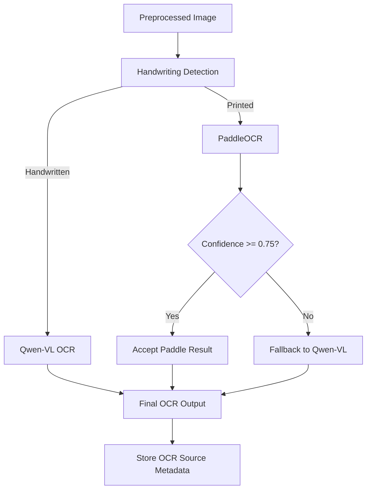
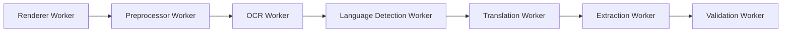
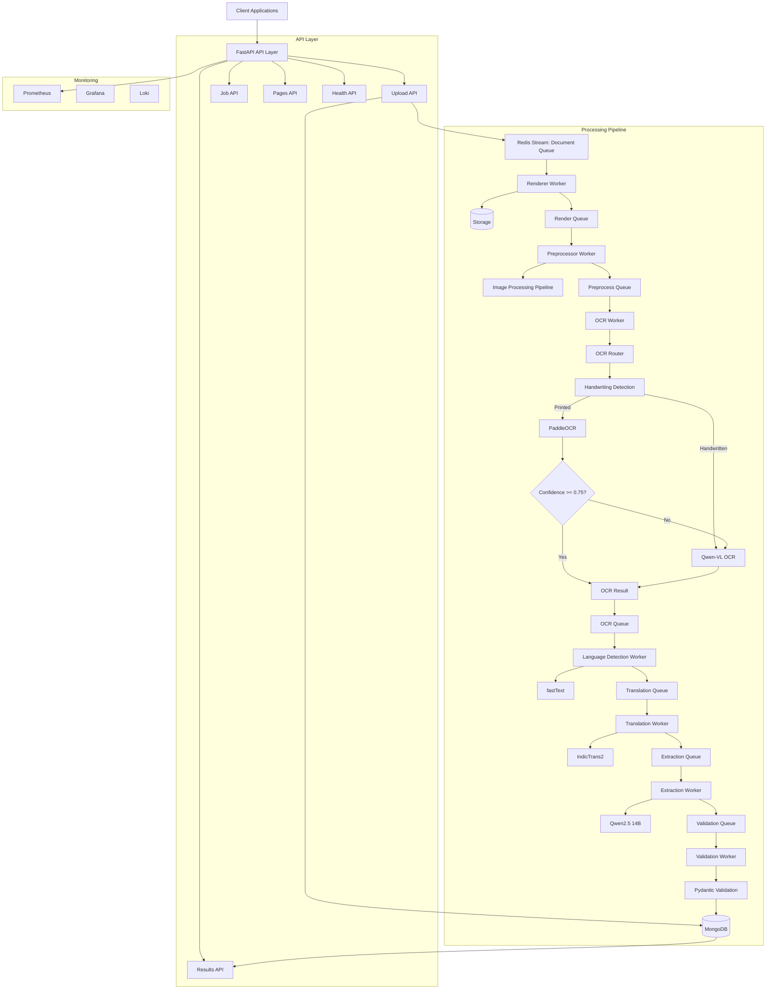

# OCR Engine

A production-style, event-driven OCR processing platform for documents such as Aadhaar cards, PAN cards, invoices, FRA forms, and land claim documents. This project combines computer vision, OCR, language detection, translation, document classification, and structured extraction into a scalable backend service built with FastAPI, Redis Streams, MongoDB, and a modular worker pipeline.

The solution is designed to be more than a simple OCR wrapper: it implements an end-to-end document processing system with asynchronous workers, retry handling, observability, validation, and extensible extraction logic.

---

## Why this project?

This repository demonstrates a complete engineering approach to building an OCR engine for real-world document workflows:

- End-to-end document ingestion from upload to structured output
- Hybrid OCR strategy using PaddleOCR with Qwen-VL fallback
- Handwriting-aware preprocessing and document-type classification
- Multi-stage pipeline with background workers and message queues
- MongoDB-backed job tracking and result persistence
- Prometheus/Grafana monitoring and structured logging
- Modular architecture suitable for production extension and scaling

---

## System architecture

This project is implemented as an event-driven document processing platform. The API layer accepts uploads, stores job metadata in MongoDB, and publishes work items into Redis Streams. A set of background workers executes each processing stage asynchronously, making the system suitable for real-world document automation workflows.

### 1. OCR decision flow



### 2. Worker architecture



### 3. High-level architecture



### Core architectural components

1. API Layer
   - Built with FastAPI
   - Exposes endpoints for upload, job status, results, health checks, and admin operations

2. Processing Pipeline
   - Renderer Worker converts PDFs into page images
   - Preprocessor Worker enhances image quality for OCR
   - OCR Worker runs hybrid OCR via PaddleOCR and Qwen-VL
   - Language Detection and Translation Workers handle multilingual text
   - Extraction and Validation Workers produce structured document data

3. Message Queue Layer
   - Redis Streams orchestrate asynchronous background processing
   - Built-in retry and dead-letter handling via worker base logic

4. Persistence Layer
   - MongoDB stores jobs, page-level OCR data, extracted results, and configuration
   - Local storage is used for incoming, processed, failed, and archived files

5. Observability Layer
   - Prometheus metrics
   - Structured logging with structlog
   - Health checks for MongoDB, Redis, Ollama, PaddleOCR, and model files

---

## Key features

### 1. Hybrid OCR engine

- Uses PaddleOCR as the primary OCR engine
- Falls back to Qwen-VL (via Ollama) for better handling of complex or low-confidence cases
- Detects handwriting and adjusts the processing path accordingly

### 2. Multi-language support

- Language detection is performed on OCR output
- Translation is applied to non-English text using IndicTrans2-based logic

### 3. Structured extraction

- Smart rule-based extraction for known Indian document formats
- Supports document-type classification for Aadhaar, PAN, invoices, FRA forms, and land claim documents
- Validation layer ensures outputs conform to expected structures

### 4. Scalable background processing

- Uploads are accepted immediately and processed asynchronously
- Workers run independently and can be scaled further if needed

### 5. Operational readiness

- Health endpoints for system diagnostics
- Metrics endpoint for Prometheus scraping
- Docker Compose setup for infrastructure dependencies

---

## Technology stack

### Backend

- Python 3.11+
- FastAPI
- Uvicorn
- Pydantic + Pydantic Settings

### Data & messaging

- MongoDB
- Redis Streams
- Motor (async MongoDB driver)

### OCR / AI / ML

- PaddleOCR
- Qwen-VL via Ollama
- fastText for language identification
- IndicTrans2 for translation
- OpenCV + Pillow for image preprocessing
- PyMuPDF for PDF rendering

### Observability

- Prometheus
- Grafana
- structlog

---

## Project structure

```text
api/                 # FastAPI routes and endpoints
services/            # Business logic for uploads, jobs, results
workers/             # Async worker pipeline for each processing stage
ml/                  # OCR, translation, classification, extraction clients
mq/                  # Redis stream producer/consumer abstractions
db/                  # MongoDB connection and collection definitions
models/              # Domain models and enums
schemas/             # Pydantic request/response schemas
middleware/          # Logging and error handling
storage/             # Incoming, processed, failed, archive files
monitoring/          # Prometheus config
tests/               # Unit/integration test suites
```

---

## API overview

### Upload endpoints

- POST /api/v1/upload
  - Upload a single PDF or image for OCR processing
- POST /api/v1/upload/bulk
  - Upload multiple files in one request

### Job endpoints

- GET /api/v1/jobs/{job_id}
  - Fetch current job status and OCR statistics
- POST /api/v1/jobs/status
  - Check the status of multiple jobs
- POST /api/v1/jobs/{job_id}/retry
  - Retry a failed or incomplete job
- DELETE /api/v1/jobs/{job_id}
  - Delete and archive a job

### Result endpoints

- GET /api/v1/results/{job_id}
  - Retrieve extracted structured output

### Health and monitoring

- GET /api/v1/health
- GET /api/v1/health/detailed
- GET /metrics

Swagger documentation is available at:

- /api/docs

---

## Example workflow

1. Upload a PDF or image through the upload endpoint.
2. The system creates a job record and pushes it into the document queue.
3. Workers render the document, preprocess it, perform OCR, detect language, translate content, classify document type, and extract fields.
4. The final structured result is stored in MongoDB and returned via the results endpoint.

---

## Local setup

### Prerequisites

- Python 3.11+
- MongoDB
- Redis
- Ollama
- Optional: Docker for infrastructure services

### Quick start (Windows example)

```powershell
cd "D:\OCR Engine\ocr_service"
python -m venv venv
.\venv\Scripts\Activate.ps1
pip install -r requirements.txt
```

Start infrastructure dependencies:

```powershell
docker-compose up -d mongodb redis ollama prometheus grafana loki
```

Run the service:

```powershell
python main.py
```

Then open:

- http://localhost:8000/api/docs
- http://localhost:9090 for Prometheus
- http://localhost:3000 for Grafana

For full setup steps, see the included setup guide.

---

## Configuration

The service uses environment variables and a settings module for configuration. Key settings include:

- MongoDB connection details
- Redis connection details
- Ollama model names
- PaddleOCR language and confidence settings
- Storage paths
- Upload size and batch limits

---

## Monitoring and observability

The system exposes:

- Application metrics via Prometheus
- Structured logs with contextual metadata
- Health checks for infrastructure components
- Job-level and page-level processing status tracking

---

## Design highlights

This project is designed with software engineering principles in mind:

- Separation of concerns between API, service, worker, and data layers
- Event-driven architecture for asynchronous processing
- Modular components for OCR, translation, extraction, and validation
- Retry-safe background processing
- Extensible document classification and extraction logic

---

## Future improvements

Potential expansion areas include:

- Horizontal scaling of worker instances
- Support for more document types and stronger schema validation
- Advanced confidence scoring and human-in-the-loop review
- Containerized production deployment with Kubernetes
- More robust model fallback and performance tuning

---

## Summary

This repository represents a complete OCR engine architecture that goes beyond basic OCR extraction. It combines AI models, background job processing, data persistence, and observability into a practical, production-minded solution for intelligent document processing.
